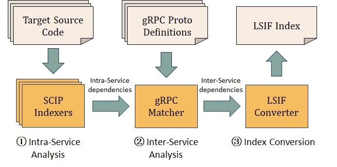

# Introduction

In this repository, there are two binaries. 

- `protoc-gen-scip`, a protoc compiler plugin
- `tool`, a utility tool

`protoc-gen-scip` is used to merge the original SCIP file and the Protobuf definition files, i.e., if you have generated some projects' SCIP index, and there are some gRPC calls/relations between these projects, you can use this plugin to build this gRPC relationships among projects.

The workflow is shown below. 
- First, you should build each projects' SCIP index. 
- Then, you can use `protoc-gen-scip` to merge these SCIP index, and merge the gRPC Proto Definitions as well.
- At last, you can use `tool` to convert it into `LISF` format, or `cypherl` file for further analysis.



We have a [benchmark](https://github.com/rpcover/RPCover) to test the functionality and performance of our plugin.
# Quick Start

## protoc-gen-scip

Run the following command, two binaries will be generated, namely `protoc-gen-scip` and `tool`

```
make all
```

## Example Usage

There are some parameters for `protoc-gen-scip`.

- `--scip_out`, the path that final scip file will be generated
- `--plugin`, specify the plugin we will use. In this case is `protoc-gen-scip`
- `--scip_opt`, the actual parameter which will be passed to the plugin
    - `scip_dir`, the input path of orginal scip files.
    - `sourceroot`, the root path of these scipfiles
    - `out_file`, the final generated file name.
- `-I`, specify the proto path
- `$(find . -name "*.proto")`, the proto files name. In this case, it will find all the proto files in the current directory

```shell
protoc --scip_out=./ --plugin=protoc-gen-scip --scip_opt=scip_dir=./,sourceroot=$(pwd),out_file=total.scip -I . $(find . -name "*.proto")
```

## tool

tool have three subcommand:

- count the lines of code in a SCIP index file. 
- convert the SCIP index file into LSIF.
- convert the SCIP index file into Cypher.

```bash
$ ./tool                                               
NAME:
   scip - SCIP Code Intelligence Protocol CLI

USAGE:
   scip [global options] command [command options] [arguments...]

VERSION:
   0.0.1

DESCRIPTION:
   For more details, see the project README at:

     https://github.com/sourcegraph/scip

COMMANDS:
   convert2lsif    Convert a SCIP index to an LSIF index
   cloc            Count a SCIP index's Lines of Code
   convert2cypher  Convert a SCIP index to memgrph...
   help, h         Shows a list of commands or help for one command

GLOBAL OPTIONS:
   --help, -h     show help (default: false)
   --version, -v  print the version (default: false)
```

In this tool, we partially referred to the implementation of the SCIP repository.


# Reference

[SCIP](https://github.com/sourcegraph/scip/tree/main)

[LSIF](https://lsif.dev/)

[RPCoverBench](https://github.com/rpcover/RPCover)